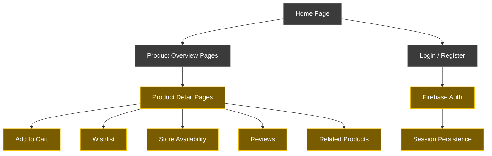

<div align="center">

# WEB_ALFKA

<p align="center">
  
</p>


### Alfka — Online Home Appliances Store

*A fully functional e-commerce website for **home appliances**, featuring product browsing, user authentication, cart management, and a seamless checkout experience.*

</div>

## Main Goal

WEB_ALFKA is a front-end web application built with **HTML, CSS, and JavaScript**, integrated with **Firebase** for user authentication and data persistence. It replicates a real-world online retail experience for home appliances — from browsing products to completing a purchase.

- Multi-page product catalogue organized by appliance category
- User registration, login, and session management via Firebase
- Shopping cart with real-time updates
- Product detail pages with specs, reviews, and related items
- Responsive design with a consistent yellow-and-white brand identity

## Features Overview

| Feature | Description |
|---------|-------------|
| **Home Page** | Hero banner, featured categories, best sellers, and promotions |
| **Product Overview Pages** | Category-level listings with filtering and product cards |
| **Product Detail Pages** | Full specs, energy ratings, store availability, reviews, and instalment payment options |
| **Login & Register** | Firebase-powered authentication with email and password |
| **Shopping Cart** | Add, remove, and review items before checkout |
| **Newsletter** | Email subscription integrated into the footer |
| **Responsive Footer** | Social links, payment methods, and support navigation |

## Pages & Functionality

### 1. Home Page (`main-page.html`)

The Home Page is the **entry point of the Alfka experience**. It features a rotating hero banner showcasing promotions and key products, followed by a horizontal scrollable product category navigator with icons for Fridges, Washing Machines, Dishwashers, Ovens, Microwaves, Exhaustors, Thermoacumulators, and Air Conditioning.

Below the categories, two carousels display:
- **Os Mais Vendidos** — the best-selling products
- **Em Promoção** — currently discounted items

The bottom of the page features a **trusted reviews section** with customer testimonials, a benefits strip (fast delivery, returns, customer support, certified products), newsletter subscription, and the full footer.

### 2. Product Overview Pages

Each appliance category has its own dedicated overview page:

- `fridge-overview-page.html`
- `washing-machine-overview-page.html`
- `dishwasher-overview-page.html`
- `oven-overview-page.html`

These pages list all products in a category with product cards showing the item name, original PVP price, discounted price, energy rating badge, and discount percentage label. Users can click any card to navigate to the respective product detail page.

### 3. Product Detail Pages

Each product has a dedicated detail page (e.g., `fridge-page.html`, `oven-page.html`) that provides a complete view of the item:

- **Image gallery** with thumbnail navigation
- **Product title, brand, EAN, and star rating**
- **Stock status** and estimated delivery date
- **Add to cart** and **wishlist** buttons
- **Store availability** — lists all physical ALFKA locations with a "Ver loja" link
- **Instalment payment options** — 3x and 6x interest-free monthly payments
- **Características (Specs table)** — full technical specifications (brand, model, dimensions, energy class, capacity, etc.)
- **Opiniões do Produto (Reviews)** — star rating breakdown and individual customer reviews
- **Produtos Relacionados** — horizontal carousel of similar products

### 4. Login & Registration (`login-page.html`)

The login page is split into two panels:

**Início de Sessão** — existing users can sign in with their email and password, with a "Forgot password?" link for account recovery.

**Criar Conta** — new users can register by entering their email and continuing to the account creation flow.

Both flows are powered by **Firebase Authentication**, ensuring secure credential handling and persistent sessions across the website.

### 5. Scripts Architecture

The JavaScript is modularized across dedicated script files:

| File | Responsibility |
|------|---------------|
| `firebase.js` | Firebase initialization, auth config, and SDK setup |
| `general.js` | Shared utilities: navbar, cart icon, newsletter, footer interactions |
| `login-page-scripts.js` | Login form handling, Firebase sign-in and registration logic |
| `main-page-scripts.js` | Hero banner carousel, category scroll, best sellers and promotions rendering |
| `product-overview-scripts.js` | Product listing rendering, filtering, and card generation |
| `products-page-scripts.js` | Product detail page logic: gallery, cart, wishlist, availability, reviews |

## Project Structure

```
WEB_ALFKA/
├── images/                        # All image assets
├── scripts/
│   ├── firebase.js
│   ├── general.js
│   ├── login-page-scripts.js
│   ├── main-page-scripts.js
│   ├── product-overview-scripts.js
│   └── products-page-scripts.js
├── styles/                        # CSS stylesheets
├── main-page.html
├── login-page.html
├── fridge-overview-page.html
├── fridge-page.html
├── washing-machine-overview-page.html
├── washing-machine-page.html
├── dishwasher-overview-page.html
├── dishwasher-page.html
├── oven-overview-page.html
└── oven-page.html
```

## System Architecture



## Setup & Installation

```bash
# Clone the repository
git clone https://github.com/<your-username>/WEB_ALFKA.git

# Open in your browser
# Simply open main-page.html in any modern browser
# No build step required
```

> Firebase credentials are configured in `scripts/firebase.js`. To run your own instance, replace the Firebase config object with your own project credentials from the [Firebase Console](https://console.firebase.google.com/).

## Technologies

| Technology | Purpose |
|------------|---------|
| **HTML5** | Page structure and semantic markup |
| **CSS3** | Styling, layout, and responsive design |
| **JavaScript (ES6+)** | Dynamic behaviour, DOM manipulation, event handling |
| **Firebase Authentication** | User login, registration, and session management |
| **Firebase Firestore** | (if applicable) User data and cart persistence |

## Authors

This project was developed as a web e-commerce application for the **Alfka** home appliances brand.

| Student | Role |
|---------|------|
| — | Front-end Development |

---

*© Alfka — Equipamentos e Serviços, Unipessoal, Lda. | NIF nº 512 345 678 | Massamá, Rua das Flores, nº 25, 2745-876 Massamá*
